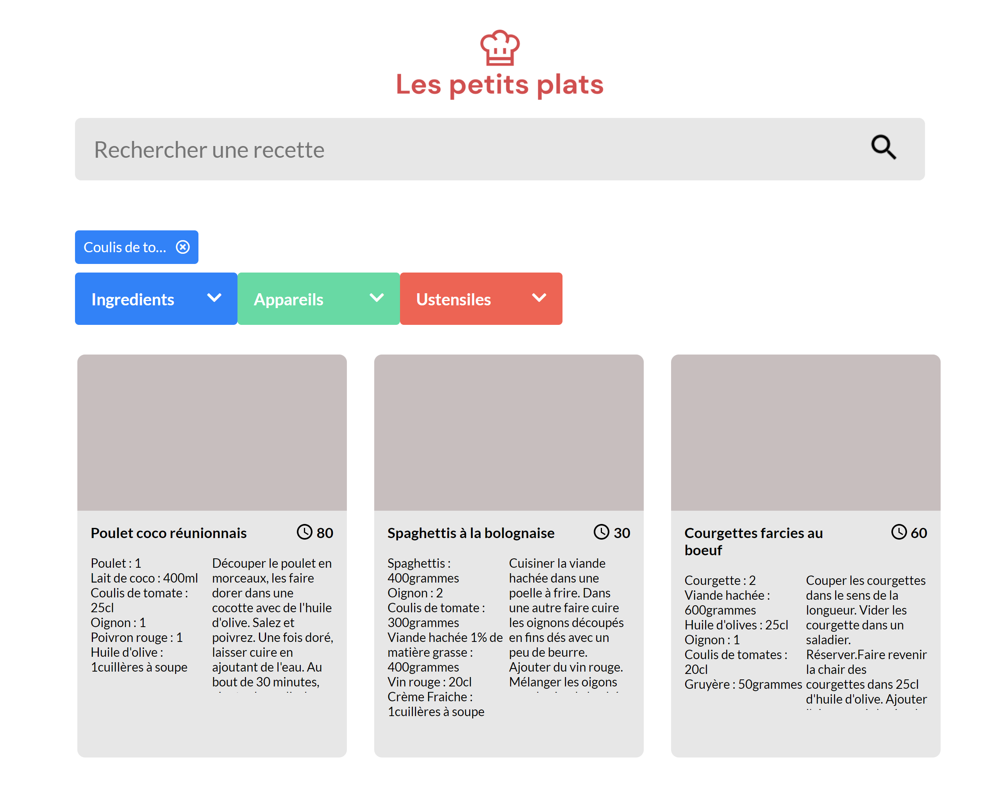

# Les petits plats
***

## Un algorithme de recherche en JavaScript
FishEye est un site web qui permet aux photographes indépendants de présenter leurs meilleurs travaux.

***
### Lien du site
https://aina200.github.io/FishEye/
***
### Maquettes du site 
https://www.figma.com/file/xqeE1ZKlHUWi2Efo8r73NK/UI-Design-Les-Petits-Plats-FR

### Cas d'utilisation de recherche
https://s3-eu-west-1.amazonaws.com/course.oc-static.com/projects/Front-End+V2/P6+Algorithms/Cas+d%E2%80%99utilisation+%2303+Filtrer+les+recettes+dans+l%E2%80%99interface+utilisateur.pdf

### Objectif :
La fluidité du moteur de recherche
"Ce que l’on veut avant tout c’est quelque chose de performant car nos utilisateurs veulent une recherche rapide, presque instantanée !"
***

